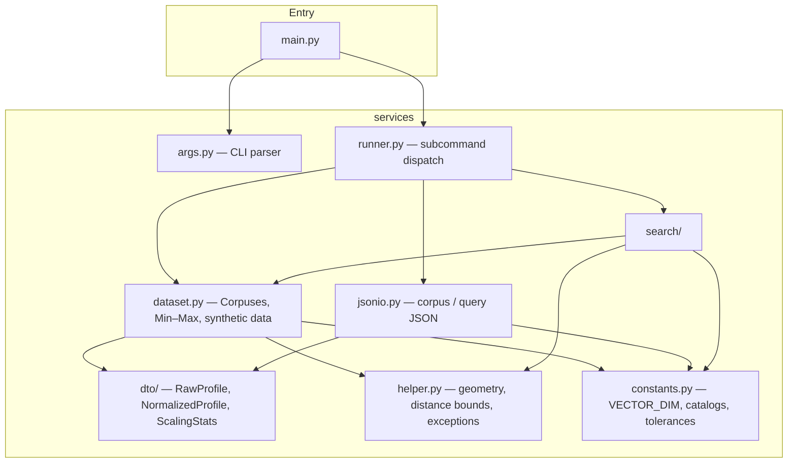

# Group project — top-k profile similarity search

Python CLI and library for **weighted squared-distance** similarity search over normalized 5-D profiles. Supports a **baseline linear scan** and a **5-D KD-tree** with the same ranking; optional timing and equivalence checks between strategies.

- **Runtime**: Python **3.12+**, **standard library only** (the installable package declares **no** runtime PyPI dependencies).
- **Optional dev tooling** ([uv](https://docs.astral.sh/uv/)): `uv sync --extra dev` installs formatters, linters, **pytest**, and **coverage** (see `pyproject.toml`).
- **Developer guide (CLI, JSON formats, tests)**: [docs/getting-started.md](docs/getting-started.md).

## Architecture

The app is split into a thin **entry** layer and **services** that own parsing, normalization, and search.



### Responsibilities

| Area | Role |
|------|------|
| **`main.py`** | Parse `argv`, delegate to `run_generate_corpus` or `run_search`. |
| **`services/args.py`** | `argparse` definitions for `generate-corpus` and `search`. |
| **`services/runner.py`** | Write synthetic corpus under `.rmit/corpus/`, run search; corpus paths, JSON results, and benchmark text use **`logging`** at **INFO** (with `main.py`’s `basicConfig`, typically **stderr**). |
| **`services/dataset.py`** | **`Corpuses`**: load/normalize corpus, encode categoricals, Min–Max stats, **`load_query`**, synthetic **`iter_synthetic_profiles`**. |
| **`services/jsonio.py`** | Load/save corpus array and query object; validate shapes. |
| **`services/dto/`** | Immutable datatypes for raw rows, normalized vectors, scaling stats. |
| **`services/constants.py`** | Feature dimension (**5**), degree/domain catalogs, query weight key order, float tolerances. |
| **`services/helper.py`** | `minmax_scalar`, AABB helpers for KD pruning, **`hits_equal`** for strategy checks, **`ValidationError`**. |
| **`services/search/`** | **`distance`**, **`topk`**, **`benchmark`**, **`strategies/`** (`BaselineSearcher`, `KDTreeSearcher` implementing **`SearchStrategy`**). |

### Data flow (search)

1. **Corpus JSON** → `Corpuses.from_json_path` → normalized profiles + **`ScalingStats`**.
2. **Query JSON** → `corpuses.load_query` → normalized query vector, weights tuple, **`k`**.
3. Chosen **searcher** builds an index (trivial for baseline, KD-tree for k-d tree) and returns top-**k** `(profile_id, distance)` pairs ordered by distance then id (see tests for tie behavior).

## Repository layout

```text
group_project/
├── README.md                 # This file
├── pyproject.toml            # Project metadata, optional [dev] deps, tool config
├── uv.lock                   # Locked dev resolution (uv)
├── .python-version           # 3.12 (for uv / pyenv)
├── docs/
│   └── getting-started.md    # CLI reference and onboarding
├── src/
│   ├── main.py               # CLI entry
│   └── services/             # All application logic (installable package)
├── tests/                    # unittest / pytest
└── specs/                    # Feature specs and design notes
```

## Quick verification

**With uv** (creates `.venv`, installs optional dev tools):

```bash
cd group_project
uv sync --extra dev
uv run python -m unittest discover -s tests -p 'test_*.py'
uv run pytest
uv run python src/main.py --help
```

**Without uv** (stdlib only; set `PYTHONPATH` yourself):

```bash
cd group_project
export PYTHONPATH="${PYTHONPATH}:$(pwd)/src"
python -m unittest discover -s tests -p 'test_*.py'
python src/main.py --help
```

Full command reference and JSON schemas: **[docs/getting-started.md](docs/getting-started.md)**.
