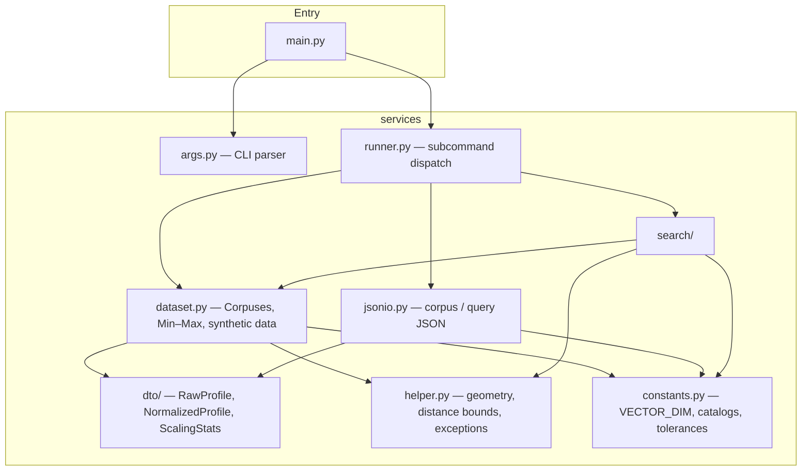

# Top-K Profile Similarity Search

A Python CLI and library for finding the **k most similar profiles** to a given query profile, using a **weighted squared-distance** metric over 5-dimensional normalized feature vectors.

Two search strategies are provided and produce identical results:

| Strategy | Build | Query | When to use |
|----------|-------|-------|-------------|
| **Baseline** (linear scan) | O(1) | O(n) | Small corpora, simplicity |
| **KD-tree** | O(n log n) | O(log n) avg | Large corpora, repeated queries |

- **Runtime**: Python 3.12+, standard library only — no PyPI dependencies.
- **Optional dev tooling** ([uv](https://docs.astral.sh/uv/)): `uv sync --extra dev` installs formatters, linters, pytest, and coverage.

---

## Quick start

### With uv (recommended)

```bash
cd group_project
uv sync --extra dev          # one-time: creates .venv, installs dev tools

# Generate a synthetic corpus of 500 profiles
uv run python src/main.py generate-corpus --N 500 --seed 42

# Search it (corpus path is printed by the generate step)
uv run python src/main.py search \
  --corpus .rmit/corpus/<timestamp>/corpus.json \
  --query path/to/query.json

# Run tests
uv run pytest
```

### Without uv (stdlib only)

```bash
cd group_project
export PYTHONPATH="$(pwd)/src"

python src/main.py generate-corpus --N 500 --seed 42
python src/main.py search \
  --corpus .rmit/corpus/<timestamp>/corpus.json \
  --query path/to/query.json

python -m unittest discover -s tests -p 'test_*.py'
```

---

## CLI reference

### `generate-corpus` — create a synthetic dataset

```bash
python src/main.py generate-corpus --N <count> [--seed <int>]
```

| Flag | Required | Description |
|------|----------|-------------|
| `--N` | yes | Number of synthetic profiles to generate (≥ 1) |
| `--seed` | no | RNG seed for reproducibility |

Writes `corpus.json` and `metadata.txt` to `.rmit/corpus/<YYYYMMDD_HHMMSS>/`. The output directory path is printed to stderr.

---

### `search` — find the k nearest profiles

```bash
python src/main.py search \
  --corpus <corpus.json> \
  --query <query.json> \
  [--strategy baseline|kdtree|both] \
  [--benchmark]
```

| Flag | Required | Default | Description |
|------|----------|---------|-------------|
| `--corpus` | yes | — | Path to corpus JSON |
| `--query` | yes | — | Path to query JSON |
| `--strategy` | no | `baseline` | `baseline`, `kdtree`, or `both` (runs both and validates they agree) |
| `--benchmark` | no | off | Print wall-clock timing to stderr |

Results are printed as JSON to stderr (via the `logging` INFO channel). Pipe stderr to capture them:

```bash
python src/main.py search --corpus corpus.json --query query.json 2>&1 >/dev/null
```

---

## JSON formats

### Corpus file

```json
[
  {
    "profile_id": "u001",
    "age": 28,
    "monthly_income": 4500,
    "daily_learning_hours": 1.5,
    "highest_degree": "bachelor",
    "favourite_domain": "software"
  }
]
```

Valid values for `highest_degree`: `none`, `certificate`, `associate`, `bachelor`, `master`, `doctorate`, `postdoc`.

Valid values for `favourite_domain`: `software`, `data_science`, `finance`, `healthcare`, `education`, `manufacturing`, `retail`, `research`, `design`, `operations`.

### Query file

```json
{
  "reference": {
    "profile_id": "q001",
    "age": 30,
    "monthly_income": 5000,
    "daily_learning_hours": 2.0,
    "highest_degree": "master",
    "favourite_domain": "data_science"
  },
  "weights": {
    "age": 1.0,
    "monthly_income": 0.5,
    "education": 2.0,
    "daily_learning_hours": 1.0,
    "domain": 1.5
  },
  "k": 5
}
```

### Search output (JSON on stderr)

```json
{
  "strategy": "baseline",
  "hits": [
    { "profile_id": "u042", "distance": 0.012 },
    { "profile_id": "u017", "distance": 0.034 }
  ],
  "timing": { "build_seconds": 0.0001, "search_seconds": 0.003 }
}
```

`timing` is only present when `--benchmark` is passed.

---

## Architecture

The app is split into a thin entry layer and a services package.



### Module responsibilities

| Module | Role |
|--------|------|
| `main.py` | Parse `argv`, delegate to runner |
| `services/args.py` | `argparse` definitions for both subcommands |
| `services/runner.py` | Write corpus, run search, emit JSON results |
| `services/dataset.py` | Load/normalize corpus, encode categoricals, Min–Max stats, synthetic generation |
| `services/jsonio.py` | Load/save corpus array and query JSON; validate shapes |
| `services/dto/` | Immutable dataclasses: `RawProfile`, `NormalizedProfile`, `ScalingStats` |
| `services/constants.py` | `VECTOR_DIM = 5`, degree/domain catalogs, weight key order, tolerances |
| `services/helper.py` | `minmax_scalar`, AABB helpers for KD pruning, `hits_equal`, `ValidationError` |
| `services/search/distance.py` | `weighted_squared_distance` |
| `services/search/topk.py` | Streaming min-heap top-k selection |
| `services/search/benchmark.py` | `perf_counter` timing helpers |
| `services/search/strategies/` | `SearchStrategy` ABC, `BaselineSearcher`, `KDTreeSearcher` |

### Data flow (search path)

```
Corpus JSON  ──► Corpuses.from_json_path()
                   │  encode categoricals (degree rank, domain index)
                   │  compute per-dimension Min–Max stats
                   └► NormalizedProfile tuple + ScalingStats

Query JSON   ──► corpuses.load_query()
                   │  normalize reference profile using corpus stats
                   └► (query_vector, weights, k)

Searcher ────────► searcher.search(query_vector, weights, k)
                   │  Baseline: O(n) scan + heap
                   │  KD-tree:  AABB pruning, O(log n) avg
                   └► [(profile_id, distance), ...]  sorted by (distance, id)
```

---

## Repository layout

```
group_project/
├── README.md
├── pyproject.toml          # project metadata, optional [dev] deps, tool config
├── uv.lock                 # locked dev resolution (uv)
├── .python-version         # 3.12
├── docs/
├── src/
│   ├── main.py             # CLI entry
│   └── services/           # all application logic
│       ├── args.py
│       ├── constants.py
│       ├── dataset.py
│       ├── helper.py
│       ├── jsonio.py
│       ├── runner.py
│       ├── dto/
│       └── search/
│           ├── distance.py
│           ├── topk.py
│           ├── benchmark.py
│           └── strategies/
│               ├── base.py
│               ├── baseline.py
│               └── kdtree.py
├── tests/                  # unittest / pytest
└── specs/                  # feature specs and design notes
```
