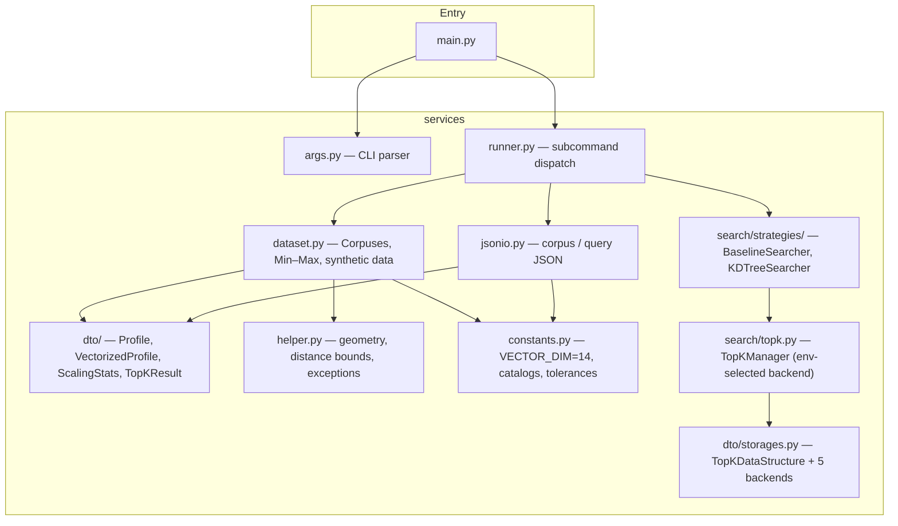

# Top-K Profile Similarity Search

A Python CLI and library for finding the **k most similar profiles** to a given query profile, using a **weighted squared-distance** metric over 14-dimensional normalized feature vectors.

Two search strategies are provided and produce identical results:

| Strategy | Build | Query | When to use |
|----------|-------|-------|-------------|
| **Baseline** (linear scan) | O(1) | O(n) | Small corpora, simplicity |
| **KD-tree** | O(n log n) | O(log n) avg | Large corpora, repeated queries |

The top-k accumulator is pluggable via the `TOPK_STORAGE` environment variable — five custom data structure backends are available (heap, sorted list, priority queue, segment tree, quickselect).

- **Runtime**: Python 3.12+, standard library only — no PyPI dependencies.
- **Optional dev tooling** ([uv](https://docs.astral.sh/uv/)): `uv sync --extra dev` installs formatters, linters, pytest, and coverage.

---

## Quick start

### With uv (recommended)

```bash
cd group_project
uv sync --extra dev          # one-time: creates .venv, installs dev tools

# Generate a synthetic corpus of 500 profiles
uv run python src/main.py build --n 500 --seed 42

# Search it (dataset path is printed by the build step)
uv run python src/main.py search \
  --dataset .rmit/dataset/<timestamp>/profiles.json \
  --query-profile samples/test.json

# Run tests
uv run pytest
```

### Without uv (stdlib only)

```bash
cd group_project
export PYTHONPATH="$(pwd)/src"

python src/main.py build --n 500 --seed 42
python src/main.py search \
  --dataset .rmit/dataset/<timestamp>/profiles.json \
  --query-profile samples/test.json

python -m unittest discover -s tests -p 'test_*.py'
```

---

## CLI reference

### `build` — create a synthetic dataset

```bash
python src/main.py build --n <count> [--seed <int>]
```

| Flag | Required | Description |
|------|----------|-------------|
| `--n` | yes | Number of synthetic profiles to generate (≥ 1) |
| `--seed` | no | RNG seed for reproducibility |

Writes `profiles.json` and `metadata.txt` to `.rmit/dataset/<YYYYMMDD_HHMMSS>/`. The output directory path is printed to stderr.

---

### `search` — find the k nearest profiles

```bash
python src/main.py search \
  --dataset <profiles.json> \
  --query-profile <query.json> \
  [--strategy baseline|kdtree] \
  [--benchmark]
```

| Flag | Required | Default | Description |
|------|----------|---------|-------------|
| `--dataset` | yes | — | Path to dataset JSON (profile array) |
| `--query-profile` | yes | — | Path to query JSON (`profile`, `weights`, `k`) |
| `--strategy` | no | `baseline` | `baseline` or `kdtree` |
| `--benchmark` | no | off | Print wall-clock timing to stderr |

Results are printed as JSON to stderr (via the `logging` INFO channel). Pipe stderr to capture them:

```bash
python src/main.py search --dataset profiles.json --query-profile query.json 2>&1 >/dev/null
```

---

## JSON formats

### Corpus file

Each record's `profile_id` must be a non-negative integer (JSON number, or a JSON string of digits such as `"42"`).

```json
[
  {
    "profile_id": 1,
    "age": 28,
    "monthly_income": 4500,
    "daily_learning_hours": 1.5,
    "highest_degree": "bachelor",
    "favourite_domain": "software"
  }
]
```

Valid values for `highest_degree`: `none`, `certificate`, `associate`, `bachelor`, `master`, `doctorate`, `postdoc`.

Valid values for `favourite_domain`: `software`, `data_science`, `finance`, `healthcare`, `education`, `manufacturing`, `retail`, `research`, `design`, `operations`.

### Query file

Top-level keys: **`profile`** (same fields as each dataset row, without `profile_id`), **`weights`**, **`k`**.

Weights use the same names as the profile fields where applicable: **`age`**, **`monthly_income`**, **`highest_degree`**, **`daily_learning_hours`**. For the ten domain dimensions you can either list every **`domain_<catalog_name>`** key explicitly, or give a single scalar **`domain`** (or **`favourite_domain`**) that applies only to the one-hot slot matching `profile.favourite_domain`.

```json
{
  "profile": {
    "age": 30,
    "monthly_income": 55.0,
    "daily_learning_hours": 3.0,
    "highest_degree": "master",
    "favourite_domain": "healthcare"
  },
  "weights": {
    "age": 0.5,
    "monthly_income": 1.0,
    "highest_degree": 5,
    "daily_learning_hours": 1.0,
    "domain": 1.0
  },
  "k": 5
}
```

You can also specify weights for every domain dimension explicitly:

```json
{
  "profile": { "..." : "..." },
  "weights": {
    "age": 0.5,
    "monthly_income": 1.0,
    "highest_degree": 5,
    "daily_learning_hours": 1.0,
    "domain_software": 1.0,
    "domain_data_science": 0.5,
    "domain_finance": 0.0,
    "domain_healthcare": 1.5,
    "domain_education": 0.0,
    "domain_manufacturing": 0.0,
    "domain_retail": 0.0,
    "domain_research": 0.0,
    "domain_design": 0.0,
    "domain_operations": 0.0
  },
  "k": 5
}
```

### Search output (JSON on stderr)

```json
{
  "distances": [
    0.00031829897376521745,
    0.006140129554417827,
    0.010782479596937813,
    0.011574201319368429,
    0.013138386871911103
  ],
  "profiles": [
    {
      "age": 31.0,
      "daily_learning_hours": 2.909181857539693,
      "favourite_domain": "healthcare",
      "highest_degree": "master",
      "monthly_income": 55.20175841409679,
      "profile_id": 61881
    },
    {
      "age": 28.0,
      "daily_learning_hours": 2.478048025106231,
      "favourite_domain": "healthcare",
      "highest_degree": "master",
      "monthly_income": 51.787395666159874,
      "profile_id": 6504
    }
  ],
  "strategy": "baseline"
}
```

- `distances` and `profiles` are parallel arrays sorted by ascending distance.
- `profiles` contains the full raw profile fields, not just the ID.
- Keys are sorted alphabetically within each object.
- With `--benchmark`, a `"timing"` key is added: `{ "build_seconds": 0.001, "search_seconds": 0.003 }`.

---

## Top-k storage backends

The top-k accumulator used during search is selected by the `TOPK_STORAGE` environment variable. All five backends produce identical results; they differ in time complexity and memory access pattern.

| `TOPK_STORAGE` value | Class | Mode | Per-push | Finalize |
|----------------------|-------|------|----------|----------|
| `heap` *(default)* | `MinHeapStorage` | streaming | O(log k) | O(k log k) |
| `sorted_list` | `SortedListStorage` | streaming | O(k) | O(k) |
| `priority_queue` | `PriorityQueueStorage` | streaming | O(log k) | O(k log k) |
| `segment_tree` | `SegmentTreeStorage` | batch | O(1) | O(k log n) |
| `quickselect` | `QuickSelectStorage` | batch | O(1) | O(n) avg |

**Streaming** backends enforce the k-capacity on every insert.  
**Batch** backends accumulate all candidates and select the top-k only at finalize time — `worst_distance()` returns `∞`, so KD-tree pruning is disabled and the tree degrades to a full scan.

```bash
# Use the sorted-list backend
export TOPK_STORAGE=sorted_list
python src/main.py search --dataset corpus.json --query-profile samples/test.json

# Use quickselect (good for large n, large k)
TOPK_STORAGE=quickselect python src/main.py search \
  --dataset corpus.json --query-profile samples/test.json --strategy baseline
```

All backends implement the `TopKDataStructure` abstract interface (`src/services/dto/storages.py`) and are accessed uniformly through `TopKManager` (`src/services/search/topk.py`).

---

## Feature encoding

Each profile is encoded into a **14-dimensional** vector before normalization:

| Index | Field | Encoding |
|-------|-------|----------|
| 0 | `age` | Min–Max normalized to [0, 1] |
| 1 | `monthly_income` | Min–Max normalized to [0, 1] |
| 2 | `highest_degree` | Ordinal rank 0–6, then Min–Max to [0, 1] |
| 3 | `daily_learning_hours` | Min–Max normalized to [0, 1] |
| 4–13 | `favourite_domain` | One-hot (10 bits, one per domain catalog entry) |

Normalization stats (per-dimension min/max) are computed from the corpus and applied to both corpus profiles and query profiles before any distance computation.

---

## Architecture

The app is split into a thin entry layer and a services package.



### Module responsibilities

| Module | Role |
|--------|------|
| `main.py` | Parse `argv`, delegate to runner |
| `services/args.py` | `argparse` definitions for `build` and `search` subcommands |
| `services/runner.py` | Write corpus, run search, emit JSON results |
| `services/dataset.py` | Load/normalize corpus, encode categoricals, Min–Max stats, synthetic generation |
| `services/jsonio.py` | Load/save corpus array and query JSON; validate and resolve weight keys |
| `services/constants.py` | `VECTOR_DIM = 14`, degree/domain catalogs, weight key order, tolerances |
| `services/helper.py` | `minmax_scalar`, AABB geometry for KD pruning, `hits_equal`, `ValidationError` |
| `services/dto/profiles.py` | Immutable dataclasses: `Profile`, `VectorizedProfile`, `VectorizedQueryProfile`, `ScalingStats`, `TopKResult` |
| `services/dto/storages.py` | `TopKDataStructure` ABC + `MinHeapStorage`, `SortedListStorage`, `PriorityQueueStorage`, `SegmentTreeStorage`, `QuickSelectStorage` |
| `services/search/distance.py` | `weighted_squared_distance` — core metric Σ wᵢ·(qᵢ−pᵢ)² |
| `services/search/topk.py` | `TopKManager` — selects backend via `TOPK_STORAGE` env var |
| `services/search/benchmark.py` | `perf_counter` timing helpers |
| `services/search/strategies/base.py` | `SearchStrategy` ABC, timing wrappers |
| `services/search/strategies/baseline.py` | `BaselineSearcher` — O(n) exhaustive scan |
| `services/search/strategies/kdtree.py` | `KDTreeSearcher` — 14-d KD-tree with AABB pruning |

### Data flow (search path)

```
Corpus JSON  ──► Corpuses.from_json_path()
                   │  encode: degree → rank, domain → one-hot (10 bits)
                   │  raw_to_prevector() → 14-float pre-vector
                   │  compute per-dimension Min–Max stats
                   └► VectorizedProfile tuple + ScalingStats

Query JSON   ──► corpuses.build_vectorized_query()
                   │  normalize query profile using corpus stats
                   └► VectorizedQueryProfile (vector, weights, k)

Searcher ────────► searcher.search(vector, weights, k)
                   │  Baseline: O(n) scan, push each distance to TopKManager
                   │  KD-tree:  DFS with AABB lower-bound pruning
                   └► [(profile_id, distance), ...]  sorted by (distance, id)

TopKManager ─────► selects TopKDataStructure from TOPK_STORAGE env var
                   └► push() / finalize() / worst_distance() / size
```

---

## Repository layout

```
group_project/
├── README.md
├── pyproject.toml              # project metadata, optional [dev] deps, tool config
├── uv.lock                     # locked dev resolution (uv)
├── .python-version             # 3.12
├── samples/
│   └── test.json               # example query file
├── docs/
├── src/
│   ├── main.py                 # CLI entry point
│   └── services/               # all application logic
│       ├── args.py             # argparse definitions
│       ├── constants.py        # VECTOR_DIM, catalogs, tolerances
│       ├── dataset.py          # Corpuses: load, encode, normalize, generate
│       ├── helper.py           # geometry, distance bounds, ValidationError
│       ├── jsonio.py           # JSON I/O for corpus and query
│       ├── runner.py           # subcommand dispatch, JSON output
│       ├── dto/
│       │   ├── profiles.py     # Profile, VectorizedProfile, ScalingStats, TopKResult
│       │   └── storages.py     # TopKDataStructure ABC + 5 backend classes
│       └── search/
│           ├── distance.py     # weighted_squared_distance
│           ├── topk.py         # TopKManager (env-selected storage backend)
│           ├── benchmark.py    # perf_counter timing helpers
│           └── strategies/
│               ├── base.py     # SearchStrategy ABC
│               ├── baseline.py # BaselineSearcher (O(n) scan)
│               └── kdtree.py   # KDTreeSearcher (AABB-pruned KD-tree)
├── tests/                      # unittest / pytest suite
└── specs/                      # feature specs and design notes
```
