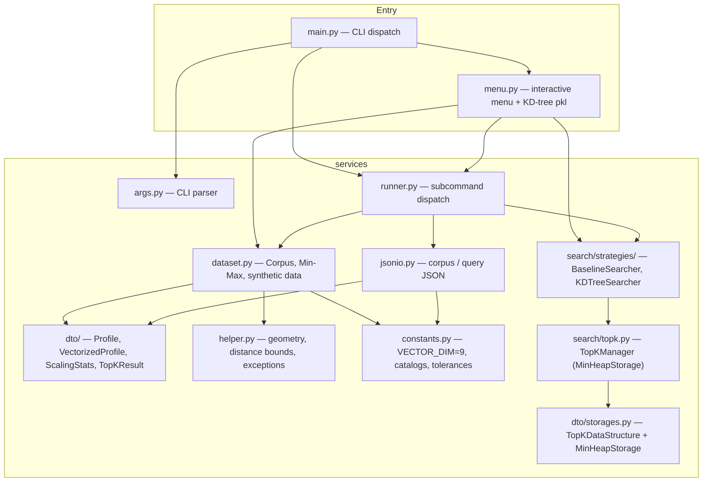

# Top-K Profile Similarity Search


> 🎬 **Demo video**: _[paste your video link here]_

---

## ⚡ How to run (Quick start)

### 1. Environment setup

**Requirements**: Python 3.12+ only — no third-party packages needed.

```bash
# Optional: install dev tools (for running tests and linting only)
pip install pytest pytest-cov ruff
```

### 2. Interactive demo menu (recommended for demos)

Run `main.py` with **no arguments** to launch a numbered menu — no flags needed:

```bash
PYTHONPATH=src python src/main.py
```

```
========================================
  Top-K Profile Similarity Search
========================================
1. Generate dataset (100,000 profiles)
2. Search with Baseline strategy
3. Search with KD-tree strategy
4. Benchmark: Baseline vs KD-tree
5. Exit
========================================
Enter option [1-5]:
```

The menu handles dataset generation, caching, and query execution automatically.  
Pass arguments as usual to skip the menu and run subcommands directly (see below).

> **KD-tree index persistence**: selecting **Option 1 (Generate dataset)** automatically
> builds the KD-tree index and saves it as `kdtree.pkl` alongside `profiles.json`.
> All subsequent **Option 3 (KD-tree search)** and **Option 4 (Benchmark)** runs load
> the pre-built index from disk — paying only the O(log n) query cost, not the
> O(n log n) build cost.

### 3. Generate a dataset

```bash
PYTHONPATH=src python src/main.py build --n 100000 --seed 42
# Prints the output path, e.g.: .rmit/dataset/20260421_164200/profiles.json
```

### 4. Run a search query

```bash
PYTHONPATH=src python src/main.py search \
  --dataset .rmit/dataset/<timestamp>/profiles.json \
  --query-profile samples/test.json \
  --strategy kdtree
```

Results are printed as JSON to stderr. To capture them:

```bash
PYTHONPATH=src python src/main.py search \
  --dataset .rmit/dataset/<timestamp>/profiles.json \
  --query-profile samples/test.json \
  --strategy kdtree 2>&1 >/dev/null
```

### 5. Input format

**Query file** (`samples/test.json`):
```json
{
  "profile": {
    "age": 30,
    "monthly_income": 55.0,
    "self_learning_hours": 3.0,
    "highest_degree": "master",
    "favourite_domain": "data_science"
  },
  "weights": {
    "age": 0.5,
    "monthly_income": 1.0,
    "highest_degree": 5,
    "self_learning_hours": 1.0,
    "domain": 1.0
  },
  "k": 5
}
```

### 6. Output format

```json
{
  "strategy": "kdtree",
  "profiles": [{ "profile_id": 12, "age": 29.0, ... }],
  "distances": [0.0123, 0.0456, ...]
}
```

Add `--benchmark` to include timing: `"timing": { "build_seconds": ..., "search_seconds": ... }`.

> **Note**: When using the interactive menu (Option 4), the benchmark for KD-tree shows
> `build_seconds: 0.000` when the index was loaded from a pre-built `kdtree.pkl` file.
> This reflects the amortized reality: the O(n log n) build cost was paid once at
> dataset generation time and is not repeated per query.

---

## Project description

A Python CLI and library for finding the **k most similar profiles** to a given query profile, using a **weighted squared-distance** metric over 9-dimensional normalized feature vectors.

Each profile is encoded into a 9-float vector (4 scalar fields + 5 one-hot domain bits). Distance is computed as the weighted sum of squared differences: **d(p,q) = Σ wᵢ(pᵢ−qᵢ)²**

Two search strategies are provided and produce identical results:

| Strategy                   | Build      | Query        | When to use                      |
| -------------------------- | ---------- | ------------ | -------------------------------- |
| **Baseline** (linear scan) | O(1)       | O(n)         | Small datasets, simplicity       |
| **KD-tree**                | O(n log n) | O(log n) avg | Large datasets, repeated queries |

Top-k candidates are maintained using a **min-heap** (`MinHeapStorage`) — O(log k) per insert, O(k log k) to finalize.

**Runtime**: Python 3.12+, standard library only — no third-party dependencies.

---

## CLI reference

### `build` — generate a synthetic dataset

```bash
python src/main.py build --n <count> [--seed <int>]
```

| Flag     | Required | Description                              |
| -------- | -------- | ---------------------------------------- |
| `--n`    | yes      | Number of synthetic profiles to generate (≥ 1) |
| `--seed` | no       | RNG seed for reproducibility             |

Writes `profiles.json`, `metadata.txt`, and **`kdtree.pkl`** to `.rmit/dataset/<YYYYMMDD_HHMMSS>/`.
The KD-tree pickle is built immediately after dataset generation and reused for all subsequent
interactive searches and benchmarks. The full path is printed to stderr.

---

### `search` — find the k nearest profiles

```bash
python src/main.py search \
  --dataset <profiles.json> \
  --query-profile <query.json> \
  [--strategy baseline|kdtree] \
  [--benchmark]
```

| Flag              | Required | Default    | Description                                    |
| ----------------- | -------- | ---------- | ---------------------------------------------- |
| `--dataset`       | yes      | —          | Path to corpus JSON                            |
| `--query-profile` | yes      | —          | Path to query JSON (`profile`, `weights`, `k`) |
| `--strategy`      | no       | `baseline` | `baseline` or `kdtree`                         |
| `--benchmark`     | no       | off        | Include wall-clock timing in output            |

Results are emitted as JSON on stderr:

```bash
PYTHONPATH=src python src/main.py search \
  --dataset profiles.json --query-profile samples/test.json 2>&1 >/dev/null
```

---

## JSON formats

### Corpus file

```json
[
  {
    "profile_id": 1,
    "age": 28,
    "monthly_income": 45,
    "self_learning_hours": 1.5,
    "highest_degree": "bachelor",
    "favourite_domain": "software_engineering"
  }
]
```

Valid `highest_degree` values: `high_school`, `bachelor`, `master`, `phd`.

Valid `favourite_domain` values: `ai`, `software_engineering`, `data_science`, `cybersecurity`, `business_analytics`.

---

### Query file

```json
{
  "profile": {
    "age": 30,
    "monthly_income": 55.0,
    "self_learning_hours": 3.0,
    "highest_degree": "master",
    "favourite_domain": "data_science"
  },
  "weights": {
    "age": 0.5,
    "monthly_income": 1.0,
    "highest_degree": 5,
    "self_learning_hours": 1.0,
    "domain": 1.0
  },
  "k": 5
}
```

The `domain` weight applies to the one-hot slot matching `profile.favourite_domain`. You can also specify every `domain_<name>` key explicitly (e.g. `domain_data_science`, `domain_ai`).

---

### Search output

`distances` and `profiles` are parallel arrays sorted by ascending distance (ties broken by ascending `profile_id`).

```json
{
  "distances": [0.2357, 0.2357, 0.2446, 0.2513, 0.2961],
  "profiles": [
    {
      "age": 43.0,
      "self_learning_hours": 1.587,
      "favourite_domain": "data_science",
      "highest_degree": "master",
      "monthly_income": 94.44,
      "profile_id": 139
    }
  ],
  "strategy": "baseline"
}
```

With `--benchmark`: `"timing": { "build_seconds": 0.002, "search_seconds": 0.005 }`.

---

## Feature encoding

| Index | Field                  | Encoding                                    |
| ----- | ---------------------- | ------------------------------------------- |
| 0     | `age`                  | Min-Max to [0, 1]                           |
| 1     | `monthly_income`       | Min-Max to [0, 1]                           |
| 2     | `highest_degree`       | Ordinal rank 0–3, then Min-Max to [0, 1]    |
| 3     | `self_learning_hours`  | Min-Max to [0, 1]                           |
| 4–8   | `favourite_domain`     | One-hot (5 bits)                            |

Normalization stats are computed from the corpus and applied to both corpus and query vectors.

---

## Architecture



### Module responsibilities

| Module                                   | Role                                                                                |
| ---------------------------------------- | ----------------------------------------------------------------------------------- |
| `main.py`                                | Parse `argv`, delegate to runner; launches `menu.py` when run interactively         |
| `menu.py`                                | Interactive numbered menu; KD-tree pickle build/load logic                          |
| `services/args.py`                       | `argparse` definitions for `build` and `search`                                     |
| `services/runner.py`                     | Execute subcommands, emit JSON results                                              |
| `services/dataset.py`                    | Load/normalize corpus, encode features, synthetic generation                        |
| `services/jsonio.py`                     | JSON I/O for corpus and query; weight key validation                                |
| `services/constants.py`                  | `VECTOR_DIM = 9`, degree/domain catalogs, tolerances                                |
| `services/helper.py`                     | `minmax_scalar`, AABB geometry, `ValidationError`                                   |
| `services/dto/profiles.py`               | Immutable dataclasses: `Profile`, `VectorizedProfile`, `ScalingStats`, `TopKResult` |
| `services/dto/storages.py`               | `TopKDataStructure` ABC + `MinHeapStorage` implementation                           |
| `services/search/topk.py`                | `TopKManager` backed by `MinHeapStorage`                                            |
| `services/search/distance.py`            | `weighted_squared_distance`                                                         |
| `services/search/strategies/baseline.py` | `BaselineSearcher` — O(n) exhaustive scan                                           |
| `services/search/strategies/kdtree.py`   | `KDTreeSearcher` — 9-d KD-tree with AABB pruning                                   |

---

## Repository layout

```
.
 README.md
 pyproject.toml          # pytest config + dev deps
 Makefile                # install / test / lint / format
 samples/
 test.json           # example query file
 src/
 main.py             # CLI entry point (lean: run() + __main__)
 menu.py             # Interactive menu + KD-tree pkl persistence
 services/
 args.py
 constants.py
 dataset.py
 helper.py
 jsonio.py
 runner.py
 dto/
 profiles.py
 storages.py
 search/
 distance.py
 topk.py
 benchmark.py
 strategies/
 base.py
 baseline.py
 kdtree.py
 tests/
 specs/
```

---

## Makefile targets

```bash
make install   # pip install pytest pytest-cov ruff
make test      # PYTHONPATH=src pytest
make lint      # ruff check src
make format    # ruff format src
```
