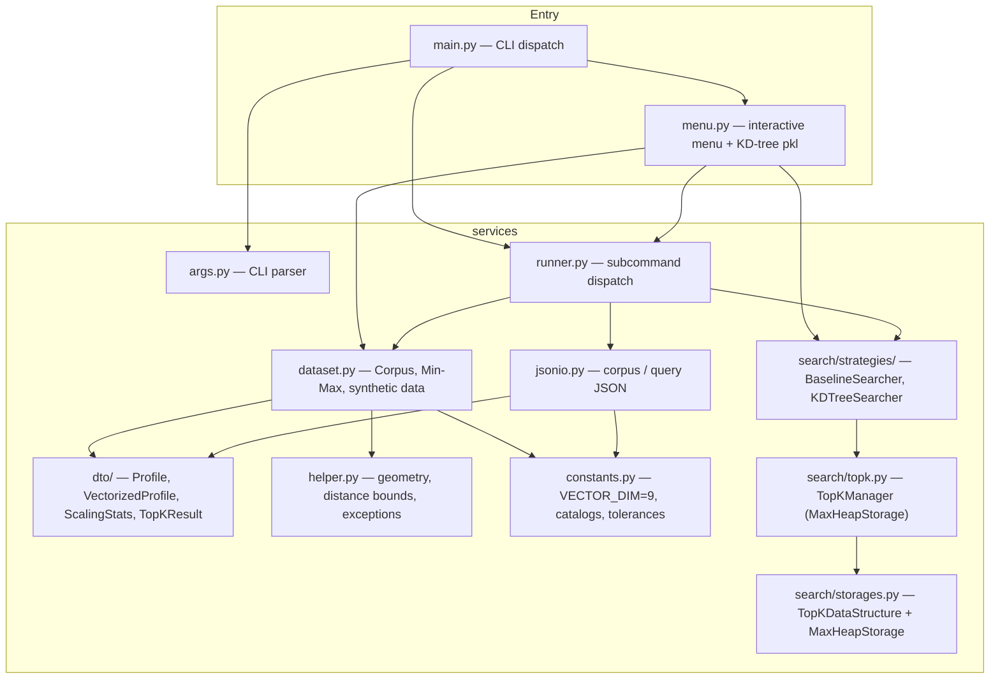

# Top-K Profile Similarity Search


> 🎬 **Demo video**: _[paste your video link here]_

---

## ⚡ How to run (Quick start)

### 1. Environment setup

**Requirements**: Python 3.12+ — no third-party packages needed to **run** the app.  
A virtual environment is only required if you want to run **tests or linting**.

Choose one of the three options below:

---

#### Option A — uv (recommended)

[uv](https://docs.astral.sh/uv/) manages Python versions and virtual environments automatically.

```bash
# Install uv (once)
curl -LsSf https://astral.sh/uv/install.sh | sh   # macOS / Linux
# Windows (PowerShell): irm https://astral.sh/uv/install.ps1 | iex

# Create a virtual environment with Python 3.12 and install dev dependencies
uv sync --extra dev
```

Activate the environment if you want to call tools directly:

```bash
source .venv/bin/activate        # macOS / Linux
.venv\Scripts\activate           # Windows
```

Or prefix every command with `uv run` to skip activation entirely:

```bash
uv run python src/main.py
uv run pytest
uv run ruff check src
```

---

#### Option B — conda

```bash
# Create and activate an isolated environment with Python 3.12
conda create -n topk-search python=3.12 -y
conda activate topk-search

# Install dev dependencies (tests + linting)
pip install -e ".[dev]"
```

To deactivate later:

```bash
conda deactivate
```

---

#### Option C — plain venv + pip

```bash
python3 -m venv .venv
source .venv/bin/activate        # Windows: .venv\Scripts\activate
pip install -e ".[dev]"
```

---

> **To run the app only**: no virtual environment needed — just Python 3.12+.

### 2. Interactive demo menu

Run `main.py` to launch the interactive menu:

```bash
# uv (no activation required)
uv run python src/main.py

# conda / venv (after activating the environment)
python src/main.py
```

```
========================================
  Top-K Profile Similarity Search
========================================
1. Generate dataset (choose sample size)
2. Search with Baseline strategy
3. Search with KD-tree strategy
4. Simple Benchmark: Baseline vs KD-tree
5. Run All Cases Benchmark: Baseline vs KD-tree
6. Exit
========================================
Enter option [1-6]:
```

---

#### Option 1 — Generate dataset

Prompts for how many profiles to generate (default: 100,000).  
If a dataset already exists you are asked whether to regenerate it.

```
Enter sample size (number of profiles) [default: 100000]: 100000
Generating 100,000 profiles …
Dataset ready: .rmit/dataset/20260502_103000/profiles.json
```

---

#### Options 2 & 3 — Search (Baseline / KD-tree)

Both options follow the same flow:

1. Auto-loads (or generates) the latest dataset.
2. Prompts you to pick a **sample profile** or enter a **custom one**.
3. Prompts for **k** (number of results, 1–20, default 5).
4. Runs the chosen strategy and prints the top-k results as JSON.

```
Choose a sample profile:
  1. Young AI enthusiast (age 22, bachelor)
  2. Mid-career software engineer (age 35, master)
  3. Data scientist (age 28, master)
  4. Cybersecurity analyst (age 31, bachelor)
  5. Senior business analyst (age 45, phd)
  6. Custom (enter manually)
  0. Cancel
Select profile [0-6]: 3

Enter k (number of results, 1–20) [default: 5]: 5
```

For **Custom**, you are guided through each field:

```
  --- Custom profile ---
  age (18–70): 27
  monthly_income in million VND (5–100): 40
  self_learning_hours per day (0–4): 2
  highest_degree:
    1. high_school
    2. bachelor
    3. master
    4. phd
  Select [1-4]: 3
  favourite_domain:
    1. ai
    2. software_engineering
    3. data_science
    4. cybersecurity
    5. business_analytics
  Select [1-5]: 3
```

---

#### Option 4 — Simple Benchmark

Picks a profile and k (same prompts as Options 2 & 3), then times both strategies side-by-side.

- **First run** — builds both indexes from scratch for accurate timing; saves `baseline.pkl` and `kdtree.pkl` next to `profiles.json`.
- **Subsequent runs** — loads both indexes from disk, so only query time is compared.

```
  First run — building both strategies fresh for accurate timing …

  ==============================================================
    BENCHMARK RESULTS
  ==============================================================
                                   Baseline (built fresh)   KD-tree (built fresh)
    ------------------------------------------------------------
    Build time  [O(1) vs O(n log n)]             0.000ms     523.417ms
    Search time [O(n)  vs O(log n)]            143.200ms       0.821ms

    KD-tree query is 174.4x faster than Baseline
  ==============================================================
```

---

#### Option 5 — Run All Cases Benchmark

Prompts for comma-separated **dataset sizes** and **k values**, then runs a full matrix across four report sections:

```
  Dataset sizes  : 10000,100000
  k values       : 5,10,20
```

| Section | What it measures |
| ------- | ---------------- |
| 1 | Effect of dataset size (fixed k, uniform weights) |
| 2 | Effect of k value (all sizes × all k values) |
| 3 | Effect of attribute weights (4 weight scenarios) |
| 4 | Correctness verification — KD-tree vs Baseline on every combination |

A summary table (Table 5) aggregates match rate, distance error, and average search time across all scenarios.

---

## Data Flow

### Flow A — Dataset generation (`build` command / Option 1)

```
User: python3 src/main.py build --n 100000 --seed 42
  └─► main.py
        └─► runner.run_generate_corpus()
              └─► dataset.py  generates 100,000 synthetic profiles
                    Each profile: age, monthly_income, self_learning_hours,
                                  highest_degree, favourite_domain
                    Output: .rmit/dataset/<timestamp>/profiles.json
                            .rmit/dataset/<timestamp>/kdtree.pkl  (pre-built index)
```

### Flow B — Similarity search (`search` command / Options 2 & 3)

```
User: selects profile + k (menu) OR passes --query-profile <file>
  └─► menu.py / main.py
        └─► runner.run_search()
              └─► jsonio.py  loads corpus + query JSON
                    │  Normalization + one-hot encoding → 9-dim vectors
                    │    dims 0-3 : age, monthly_income, self_learning_hours,
                    │               degree_rank  (Min-Max → [0,1])
                    │    dims 4-8 : domain one-hot bits
                    │               (ai / software_engineering / data_science /
                    │                cybersecurity / business_analytics)
                    │
                    ├─► Baseline strategy
                    │     Linear O(n) scan of all 100,000 profiles
                    │     MaxHeap(k) accumulates top-k  → O(n log k) total
                    │
                    └─► KD-tree strategy
                          9-dim KD-tree with AABB pruning → O(log n) avg query
                          MaxHeap(k) for result accumulation
                          (index loaded from kdtree.pkl when available)

Returns: top-k profiles + distances as JSON
```

### Flow C — Benchmark (Option 4)

```
First run per session
  ├─► Baseline  built fresh → real build time logged
  └─► KD-tree   built fresh → real build time logged
      Both indexes saved as baseline.pkl / kdtree.pkl

Second run (indexes already on disk)
  ├─► Baseline  loaded from pkl → build time = 0 ms
  └─► KD-tree   loaded from pkl → build time = 0 ms

Output: side-by-side timing table + speedup ratio
```

---

## Project description

A Python CLI and library for finding the **k most similar profiles** to a given query profile, using a **weighted squared-distance** metric over 9-dimensional normalized feature vectors.

Each profile is encoded into a 9-float vector (4 scalar fields + 5 one-hot domain bits). Distance is computed as the weighted sum of squared differences: **d(p,q) = Σ wᵢ(pᵢ−qᵢ)²**

Two search strategies are provided and produce identical results:

| Strategy                   | Build      | Query        | When to use                      |
| -------------------------- | ---------- | ------------ | -------------------------------- |
| **Baseline** (linear scan) | O(1)       | O(n)         | Small datasets, simplicity       |
| **KD-tree**                | O(n log n) | O(log n) avg | Large datasets, repeated queries |

Top-k candidates are maintained using a **max-heap** (`MaxHeapStorage`) — O(log k) per insert, O(k log k) to finalize.

**Runtime**: Python 3.12+, standard library only — no third-party dependencies.

---

## JSON formats

### Corpus file

```json
[
  {
    "profile_id": 1,
    "age": 28,
    "monthly_income": 45,
    "self_learning_hours": 1.5,
    "highest_degree": "bachelor",
    "favourite_domain": "software_engineering"
  }
]
```

Valid `highest_degree` values: `high_school`, `bachelor`, `master`, `phd`.

Valid `favourite_domain` values: `ai`, `software_engineering`, `data_science`, `cybersecurity`, `business_analytics`.

---

### Query file

```json
{
  "profile": {
    "age": 30,
    "monthly_income": 55.0,
    "self_learning_hours": 3.0,
    "highest_degree": "master",
    "favourite_domain": "data_science"
  },
  "weights": {
    "age": 0.5,
    "monthly_income": 1.0,
    "highest_degree": 5,
    "self_learning_hours": 1.0,
    "domain": 1.0
  },
  "k": 5
}
```

The `domain` weight applies to the one-hot slot matching `profile.favourite_domain`. You can also specify every `domain_<name>` key explicitly (e.g. `domain_data_science`, `domain_ai`).

---

### Search output

`distances` and `profiles` are parallel arrays sorted by ascending distance (ties broken by ascending `profile_id`).

```json
{
  "distances": [0.2357, 0.2357, 0.2446, 0.2513, 0.2961],
  "profiles": [
    {
      "age": 43.0,
      "self_learning_hours": 1.587,
      "favourite_domain": "data_science",
      "highest_degree": "master",
      "monthly_income": 94.44,
      "profile_id": 139
    }
  ],
  "strategy": "baseline"
}
```

---

## Feature encoding

| Index | Field                 | Encoding                                 |
| ----- | --------------------- | ---------------------------------------- |
| 0     | `age`                 | Min-Max to [0, 1]                        |
| 1     | `monthly_income`      | Min-Max to [0, 1]                        |
| 2     | `self_learning_hours` | Min-Max to [0, 1]                        |
| 3     | `highest_degree`      | Ordinal rank 0–3, then Min-Max to [0, 1] |
| 4–8   | `favourite_domain`    | One-hot (5 bits)                         |

Normalization stats are computed from the corpus and applied to both corpus and query vectors.

---

## Architecture



### Module responsibilities

| Module                                   | Role                                                                                |
| ---------------------------------------- | ----------------------------------------------------------------------------------- |
| `main.py`                                | Parse `argv`, delegate to runner; launches `menu.py` when run interactively         |
| `menu.py`                                | Interactive numbered menu; KD-tree pickle build/load logic                          |
| `services/args.py`                       | `argparse` definitions for `build` and `search`                                     |
| `services/runner.py`                     | Execute subcommands, emit JSON results                                              |
| `services/dataset.py`                    | Load/normalize corpus, encode features, synthetic generation                        |
| `services/jsonio.py`                     | JSON I/O for corpus and query; weight key validation                                |
| `services/constants.py`                  | `VECTOR_DIM = 9`, degree/domain catalogs, tolerances                                |
| `services/helper.py`                     | `minmax_scalar`, AABB geometry, `ValidationError`                                   |
| `services/dto/profiles.py`               | Immutable dataclasses: `Profile`, `VectorizedProfile`, `ScalingStats`, `TopKResult` |
| `services/search/storages.py`            | `TopKDataStructure` ABC + `MaxHeapStorage` implementation                           |
| `services/search/topk.py`                | `TopKManager` backed by `MaxHeapStorage`                                            |
| `services/search/distance.py`            | `weighted_squared_distance`                                                         |
| `services/search/strategies/baseline.py` | `BaselineSearcher` — O(n) exhaustive scan                                           |
| `services/search/strategies/kdtree.py`   | `KDTreeSearcher` — 9-d KD-tree with AABB pruning                                    |

---

## Repository layout

```
.
 README.md
 pyproject.toml          # pytest config + dev deps
 Makefile                # install / test / lint / format
 samples/
 test.json           # example query file
 src/
 main.py             # CLI entry point (lean: run() + __main__)
 menu.py             # Interactive menu + KD-tree pkl persistence
 services/
 args.py
 constants.py
 dataset.py
 helper.py
 jsonio.py
 runner.py
 dto/
 profiles.py
 storages.py
 search/
 distance.py
 topk.py
 benchmark.py
 strategies/
 base.py
 baseline.py
 kdtree.py
 tests/
 specs/
```

---

## Makefile targets

```bash
make install   # pip3 install pytest pytest-cov ruff
make test      # PYTHONPATH=src pytest
make lint      # ruff check src
make format    # ruff format src
```

If you set up the environment with **uv**, replace `make install` with `uv sync --extra dev`
and prefix the remaining targets with `uv run`:

```bash
uv sync --extra dev          # install dev deps (replaces make install)
uv run pytest                # run tests
uv run ruff check src        # lint
uv run ruff format src       # format
```

For **conda**, activate the environment first (`conda activate topk-search`), then use the
`make` targets as normal.
